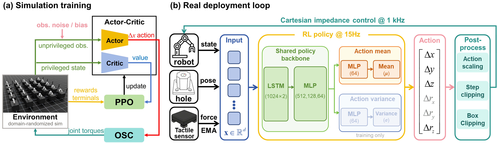

# TacInsert

[](https://docs.isaacsim.omniverse.nvidia.com/latest/index.html)
[](https://docs.isaacsim.omniverse.nvidia.com/latest/index.html)
[](https://docs.python.org/3/whatsnew/3.11.html)
[](https://releases.ubuntu.com/22.04/)
[](https://www.microsoft.com/en-us/)
[](https://opensource.org/licenses/BSD-3-Clause)
[](#pretrained-checkpoints)

TacInsert is an Isaac Lab project for force-conditioned, contact-rich peg-in-hole insertion in simulation and on a real Franka robot. It targets ultra-tight precision insertion, including Tol. IV settings with nominal clearance down to 0.02 mm. The repository provides:

- Isaac Lab direct-RL environments for precision insertion across multiple hole shapes and tolerances.
- RL-Games training and evaluation scripts for simulation experiments.
- Contact-force-conditioned observation, reward, logging, and evaluation support.
- Stable force-conditioned training with force-signal smoothing and globally shared policy variance.
- ManipulationNet-style single-hole sampler tasks for multi-tolerance policies.
- Real-robot closed-loop deployment utilities for Franka sim-to-real experiments.
- Smoke-test checkpoints distributed separately for anonymous review.

The codebase accompanies the paper:

```text
TacInsert: Force-Conditioned Sim-to-Real RL for Ultra-Tight Precision Insertion
```


**Figure 1.** TacInsert performs force-conditioned sim-to-real precision insertion on a physical Franka setup with a gripper-mounted fingertip tactile sensor. The overview highlights the role of force feedback during insertion and summarizes real-robot performance on the tightest tolerance setting.



**Figure 2.** TacInsert combines a decoupled gated reward, smoothed force observations, globally shared policy variance, asymmetric actor-critic training in Isaac Lab, and real-robot deployment through Cartesian impedance control.

## Highlights

- **Simulation-trained, real-robot deployed.** Policies are trained entirely in Isaac Lab and deployed on a real Franka robot through calibrated target poses and deployable robot observations.
- **Force-conditioned insertion.** The policy can use a compact three-axis contact-force signal for local contact-rich correction under target-pose bias and tight clearances.
- **Stable contact-rich RL.** Force-signal smoothing and globally shared policy variance improve training stability when force observations change abruptly during contact transitions.
- **Multi-tolerance learning.** The tolerance-adaptive sampler reallocates simulation experience toward harder clearance levels while preserving coverage of all tolerance classes.

## Project Status

TacInsert is organized as an external Isaac Lab extension. The simulation side is self-contained inside this repository, including open USD assets, task configurations, RL-Games training configs, and optional checkpoint instructions. The released tasks cover controlled single-hole insertion and ManipulationNet-style multi-tolerance sampler settings. The real-robot side provides deployment code and configuration templates, but requires a compatible Franka control stack, a calibrated robot setup, and operator supervision.

## Installation

Install NVIDIA Isaac Sim and Isaac Lab first. Follow the official Isaac Lab repository and installation guide:

- [isaac-sim/IsaacLab](https://github.com/isaac-sim/IsaacLab)

Then install TacInsert from this repository:

```bash
python -m pip install -e source/TacInsert
```

List the registered TacInsert environments:

```bash
python scripts/list_envs.py
```

## Simulation Experiments

Simulation tasks, reward settings, observation schemas, contact-force options, sampler tasks, training commands, TensorBoard usage, and evaluation commands are documented here:

- [Simulation README](source/TacInsert/TacInsert/tasks/direct/tacinsert/README.md)

Example training command:

```bash
python scripts/rl_games/train.py --task TacInsert-CircleHole-I-Direct-v0 --num_envs 128 --headless
```

Example evaluation command:

```bash
python scripts/rl_games/play.py \
  --task TacInsert-LHole-III-Direct-v0 \
  --num_envs 128 \
  --headless \
  --checkpoint source/TacInsert/TacInsert/tasks/direct/tacinsert/checkpoints/TacInsert-LHole-III-Direct-v0.pth
```

Registered simulation tasks:

| Gym ID | Description |
| --- | --- |
| `TacInsert-CircleHole-I-Direct-v0` | Circle hole, Tol. I |
| `TacInsert-SquareHole-II-Direct-v0` | Square hole, Tol. II |
| `TacInsert-LHole-III-Direct-v0` | L-shape hole, Tol. III |
| `TacInsert-TriangleHole-IV-Direct-v0` | Triangle hole, Tol. IV |
| `TacInsert-HexagonHole-IV-Direct-v0` | Hexagon hole, Tol. IV |
| `TacInsert-Manipulation-Square-SingleHole-Direct-v0` | ManipulationNet-style square single-hole sampler |
| `TacInsert-Manipulation-Circle-SingleHole-Direct-v0` | ManipulationNet-style circle single-hole sampler |

## Pretrained Checkpoints

Pretrained smoke-test checkpoints are distributed separately for anonymous review. Checkpoint binaries are not committed to this repository because they are large model artifacts.

If an anonymous checkpoint host is provided, download them into the local checkpoint directory:

```powershell
hf download <ANONYMOUS_CHECKPOINT_REPO> TacInsert-LHole-III-Direct-v0.pth `
  --repo-type model `
  --local-dir source/TacInsert/TacInsert/tasks/direct/tacinsert/checkpoints

hf download <ANONYMOUS_CHECKPOINT_REPO> TacInsert-Manipulation-Square-SingleHole-Direct-v0.pth `
  --repo-type model `
  --local-dir source/TacInsert/TacInsert/tasks/direct/tacinsert/checkpoints
```

Checkpoint filenames, SHA256 hashes, observation dimensions, and smoke-test commands are documented in:

- [Checkpoint README](source/TacInsert/TacInsert/tasks/direct/tacinsert/checkpoints/README.md)

Large checkpoint binaries are intentionally ignored by git.

## Real-Robot Deployment

The real-robot deployment code lives in:

- [Sim-to-Real README](source/TacInsert/TacInsert/tasks/direct/tacinsert/sim2real/README.md)

The current runner targets a Franka robot server compatible with the HTTP control style used by Berkeley SERL and HIL-SERL:

- [rail-berkeley/serl](https://github.com/rail-berkeley/serl)
- [rail-berkeley/hil-serl](https://github.com/rail-berkeley/hil-serl)

The deployment script does not import SERL or HIL-SERL directly. It communicates through a small robot-server interface:

- `POST /getstate`
- `POST /pose`
- `POST /open_gripper`
- `POST /close_gripper`

If you use another Franka Python interface, such as [JeanElsner/panda-py](https://github.com/JeanElsner/panda-py), the same runner can be reused by adapting the robot I/O layer, as long as the backend provides stable Cartesian-space impedance control, state feedback, gripper control, and optional force feedback. See the sim-to-real README for the exact contract and modification points.

## Repository Layout

```text
TacInsert/
  scripts/
    list_envs.py
    rl_games/
      train.py
      play.py
  source/TacInsert/TacInsert/tasks/direct/tacinsert/
    tacinsert_env.py
    tacinsert_env_cfg.py
    tacinsert_tasks_cfg.py
    tacinsert_control.py
    tacinsert_utils.py
    tactile_datalogger.py
    agents/
    assets/
    checkpoints/
    figures/
    sim2real/
```

## Development Notes

Useful checks:

```bash
python scripts/list_envs.py
python -m py_compile source/TacInsert/TacInsert/tasks/direct/tacinsert/*.py
```

Code formatting:

```bash
python -m black source/TacInsert scripts
```

Generated logs, local checkpoints, Python caches, and runtime outputs are ignored by git.

## License

This project is released under the BSD 3-Clause License. See [LICENSE](LICENSE) for details.

## Acknowledgements

TacInsert builds on the Isaac Sim and Isaac Lab ecosystem. We thank the Isaac Lab developers for the open robotics simulation framework:

- [isaac-sim/IsaacLab](https://github.com/isaac-sim/IsaacLab)

The real-robot deployment design follows the practical Franka control style used in Berkeley SERL and HIL-SERL. We thank the authors of these projects for releasing their real-robot reinforcement learning infrastructure:

- [rail-berkeley/serl](https://github.com/rail-berkeley/serl)
- [rail-berkeley/hil-serl](https://github.com/rail-berkeley/hil-serl)
